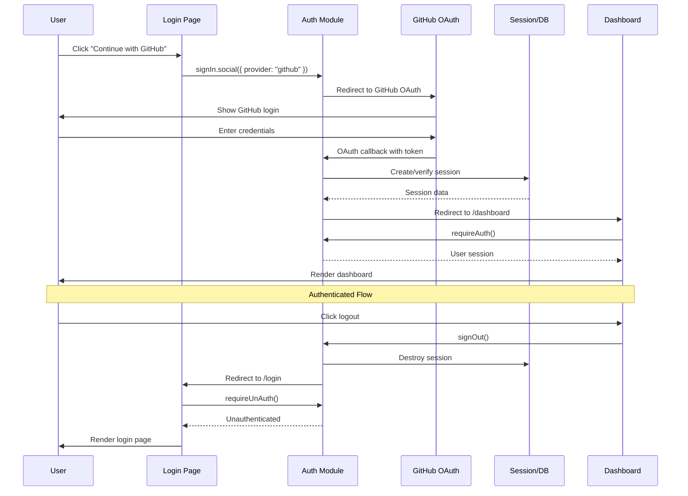
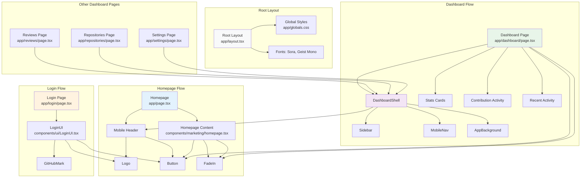
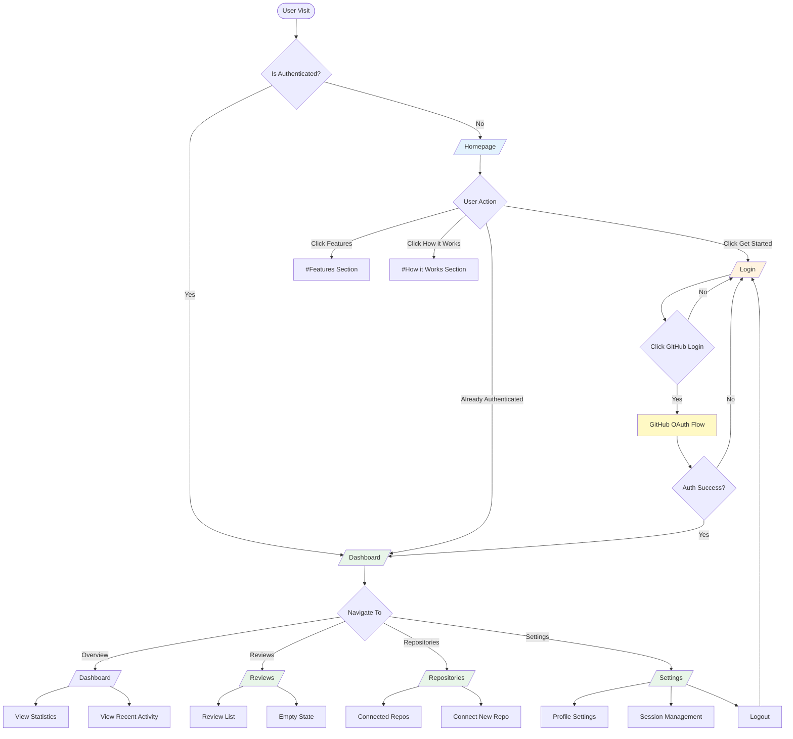
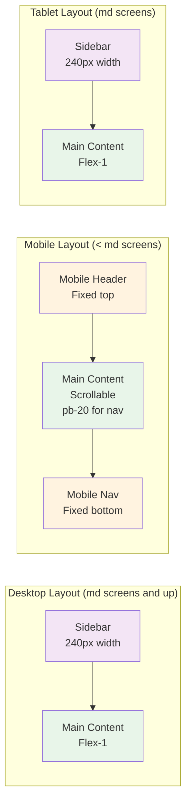
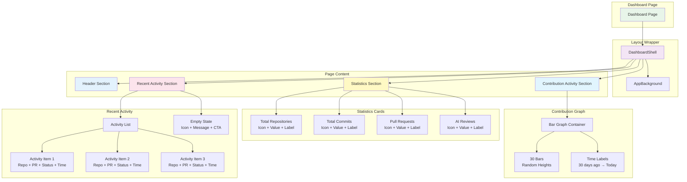

# codeSentinel - Project Structure & Architecture

## Overview

codeSentinel is a SaaS application for AI-powered code review automation. This document outlines the project structure, component architecture, data flow, and implementation guidelines for developers working on this project.

## Tech Stack

- **Framework**: Next.js 15 with App Router
- **Language**: TypeScript
- **Styling**: Tailwind CSS v4
- **UI Components**: shadcn/ui
- **Animations**: Motion (Framer Motion)
- **Icons**: Lucide React
- **Authentication**: Custom auth module with GitHub OAuth

## Directory Structure

```
code_review/
├── app/                                    # Next.js App Router pages
│   ├── dashboard/                          # Dashboard pages
│   │   └── page.tsx                       # Main dashboard overview
│   ├── login/                             # Authentication pages
│   │   └── page.tsx                       # Login page
│   ├── repositories/                      # Repository management
│   │   └── page.tsx                       # Connected repositories
│   ├── reviews/                           # PR reviews
│   │   └── page.tsx                       # Review history
│   ├── settings/                          # User settings
│   │   └── page.tsx                       # Account settings
│   ├── globals.css                        # Global styles and design tokens
│   ├── layout.tsx                         # Root layout with fonts
│   └── page.tsx                           # Homepage
├── components/                            # React components
│   ├── brand/                            # Branding components
│   │   └── logo.tsx                      # Logo component
│   ├── layout/                           # Layout components
│   │   ├── dashboard-shell.tsx            # Dashboard layout wrapper
│   │   ├── sidebar.tsx                    # Desktop sidebar navigation
│   │   ├── mobile-nav.tsx                 # Mobile bottom navigation
│   │   └── app-background.tsx             # Background wrapper
│   ├── marketing/                        # Marketing/landing page components
│   │   └── homepage.tsx                  # Landing page
│   └── ui/                               # Reusable UI components
│       ├── button.tsx                     # Button component
│       ├── fade-in.tsx                    # Animation wrapper
│       ├── login-ui.tsx                   # Login UI component
│       ├── avatar.tsx                     # User avatar
│       └── logout.tsx                     # Logout button
├── lib/                                  # Utility functions
│   └── utils.ts                         # Helper functions (cn, etc.)
└── module/                               # Custom modules
    └── auth/                             # Authentication module
        └── utils/
            └── auth-utils.ts             # Auth utilities (requireAuth, etc.)
```

## Visual Architecture Diagram

```mermaid
graph TB
    subgraph "User Interface Layer"
        HP[Homepage<br/>app/page.tsx]
        LP[Login Page<br/>app/login/page.tsx]
        DP[Dashboard<br/>app/dashboard/page.tsx]
        RP[Reviews Page<br/>app/reviews/page.tsx]
        REP[Repositories Page<br/>app/repositories/page.tsx]
        SP[Settings Page<br/>app/settings/page.tsx]
    end

    subgraph "Layout Components"
        DS[DashboardShell<br/>components/layout/dashboard-shell.tsx]
        SB[Sidebar<br/>components/layout/sidebar.tsx]
        MN[MobileNav<br/>components/layout/mobile-nav.tsx]
        MH[Mobile Header<br/>in DashboardShell]
        ABG[AppBackground<br/>components/layout/app-background.tsx]
    end

    subgraph "UI Components"
        BTN[Button<br/>components/ui/button.tsx]
        FI[FadeIn<br/>components/ui/fade-in.tsx]
        AV[Avatar<br/>components/ui/avatar.tsx]
        LOGO[Logo<br/>components/brand/logo.tsx]
        LO[Logout<br/>components/ui/logout.tsx]
    end

    subgraph "Authentication Module"
        AUTH[Auth Utils<br/>module/auth/utils/auth-utils.ts]
        RA[requireAuth]
        RUA[requireUnAuth]
        SI[signIn.social]
        SO[signOut]
    end

    subgraph "Utilities"
        UTILS[Utils<br/>lib/utils.ts]
        CN[cn function]
    end

    subgraph "Styling"
        GS[Global Styles<br/>app/globals.css]
        RL[Root Layout<br/>app/layout.tsx]
    end

    %% Layout Relationships
    DS --> SB
    DS --> MN
    DS --> MH
    DS --> ABG

    %% Page to Layout
    DP --> DS
    RP --> DS
    REP --> DS
    SP --> DS
    HP --> ABG
    LP --> ABG

    %% Component Usage
    SB --> LOGO
    SB --> AV
    SB --> LO
    MN --> LOGO
    MH --> LOGO
    MH --> AV
    MH --> LO

    %% UI Component Usage
    DP --> FI
    RP --> FI
    REP --> FI
    SP --> FI
    HP --> FI
    DP --> BTN
    RP --> BTN
    REP --> BTN

    %% Authentication Flow
    LP --> AUTH
    DP --> AUTH
    RP --> AUTH
    REP --> AUTH
    SP --> AUTH
    AUTH --> RA
    AUTH --> RUA
    AUTH --> SI
    AUTH --> SO

    %% Utilities
    DS --> UTILS
    SB --> UTILS
    MN --> UTILS
    BTN --> UTILS
    FI --> UTILS

    %% Styling
    DS --> GS
    SB --> GS
    MN --> GS
    HP --> GS
    LP --> GS
    DP --> GS
    RP --> GS
    REP --> GS
    SP --> GS
    RL --> GS

    %% Root Layout
    HP --> RL
    LP --> RL
    DP --> RL
    RP --> RL
    REP --> RL
    SP --> RL

    style HP fill:#e1f5ff
    style LP fill:#fff4e1
    style DP fill:#e8f5e9
    style RP fill:#e8f5e9
    style REP fill:#e8f5e9
    style SP fill:#e8f5e9
    style DS fill:#f3e5f5
    style SB fill:#f3e5f5
    style MN fill:#f3e5f5
    style AUTH fill:#fce4ec
```



## Authentication Flow Diagram



## Component Hierarchy Diagram



## Page Routing Flow Diagram



## Responsive Layout Diagram



## Dashboard Page Structure Diagram



## Component Architecture

### Layout Components

#### DashboardShell
**Purpose**: Main layout wrapper for all authenticated dashboard pages.

**Responsibilities**:
- Handles responsive layout switching
- Shows sidebar on desktop (md screens and up)
- Shows mobile header on small screens
- Provides scrollable main content area
- Includes mobile bottom navigation

**Props**:
- `user`: Authenticated user object (name, email, image)
- `children`: Page content to render
- `className`: Optional additional classes for main content

**Usage**:
```tsx
<DashboardShell user={session.user}>
  {/* Page content */}
</DashboardShell>
```

#### Sidebar
**Purpose**: Desktop navigation sidebar for dashboard.

**Responsibilities**:
- Displays navigation links with active state
- Shows user profile information
- Provides logout functionality
- Only visible on md screens and up

**Navigation Items**:
- Overview (`/dashboard`)
- Reviews (`/reviews`)
- Repositories (`/repositories`)
- Settings (`/settings`)

**Usage**:
```tsx
<Sidebar user={session.user} />
```

#### MobileNav
**Purpose**: Bottom navigation bar for mobile devices.

**Responsibilities**:
- Provides quick access to main dashboard pages
- Only visible on small screens (hidden on md+)
- Uses same navigation items as sidebar for consistency

**Usage**:
```tsx
<MobileNav />
```

### UI Components

#### FadeIn
**Purpose**: Animation wrapper for smooth content transitions.

**Responsibilities**:
- Fades in content with subtle upward motion
- Uses Motion library for performance
- Configurable delay for staggered animations

**Props**:
- `children`: Content to animate
- `className`: Optional additional classes
- `delay`: Animation delay in seconds (default: 0)

**Usage**:
```tsx
<FadeIn delay={0.1}>
  <h1>Hello World</h1>
</FadeIn>
```

#### Button
**Purpose**: Reusable button component with multiple variants.

**Variants**:
- `default`: Primary action button
- `outline`: Outlined button
- `secondary`: Secondary action
- `ghost`: Minimal button
- `destructive`: Danger action
- `link`: Link-style button

**Sizes**:
- `default`: Standard size
- `sm`: Small
- `lg`: Large
- `xs`: Extra small
- `icon`: Icon-only variants

**Usage**:
```tsx
<Button size="sm" variant="outline">
  Click me
</Button>
```

## Page Structure

### Authentication Flow

1. **Unauthenticated User**:
   - Visits `/` → Homepage
   - Clicks "Get started" → `/login`
   - Clicks GitHub login → Auth module handles OAuth
   - On success → Redirects to `/dashboard`

2. **Authenticated User**:
   - Visits `/` → Redirects to `/dashboard`
   - All dashboard pages require authentication via `requireAuth()`
   - Logout → Redirects to `/`

### Page Routes

| Route | Component | Authentication | Description |
|-------|-----------|----------------|-------------|
| `/` | Homepage | Optional | Landing page with product info |
| `/login` | LoginUI | Required unauth | GitHub OAuth login |
| `/dashboard` | DashboardPage | Required | Main overview with stats and activity |
| `/reviews` | ReviewsPage | Required | PR review history |
| `/repositories` | RepositoriesPage | Required | Connected repository management |
| `/settings` | SettingsPage | Required | User account settings |

### Dashboard Page Structure

The dashboard page (`app/dashboard/page.tsx`) follows this structure:

1. **Header Section**
   - Title: "Overview"
   - Personalized welcome message

2. **Statistics Section**
   - 4 stat cards with icons and values
   - Total Repositories
   - Total Commits
   - Pull Requests
   - AI Reviews

3. **Contribution Activity Section**
   - Visual bar graph (placeholder)
   - Shows 30-day activity
   - Hover effects on bars

4. **Recent Activity Section**
   - List of recent PR reviews
   - Repository name
   - PR title
   - Status (completed/in progress)
   - Timestamp
   - Empty state with CTA when no activity

## Design System

### Color Palette

The application uses a monochrome palette with subtle accents:

**Dark Mode (Primary)**:
- Background: `#000000` (pure black)
- Foreground: `#fafafa` (off-white)
- Card: `#090909` (near black)
- Border: `#1a1a1a` (subtle gray)
- Muted: `#0f0f0f` (dark gray)
- Accent: `#171717` (medium gray)

**Typography Colors**:
- Primary text: `#fafafa` (white)
- Secondary text: `#8a8a8a` (gray)
- Tertiary text: `#525252` (darker gray)
- Status colors (green/amber) for activity indicators

### Typography

**Font Families**:
- Sans-serif: Sora (primary)
- Mono: Geist Mono (code)

**Font Sizes**:
- Headings: `text-2xl` to `text-3xl` (desktop)
- Body: `text-sm` to `text-base`
- Labels: `text-xs` to `text-sm`

**Tracking**:
- Headings: `tracking-[-0.02em]` to `tracking-[-0.04em]`
- Tight tracking for premium feel

### Spacing

**Container Widths**:
- Marketing pages: `max-w-6xl`
- Dashboard pages: `max-w-5xl` to `max-w-6xl`

**Padding**:
- Mobile: `px-6 py-10`
- Desktop: `md:px-10 md:py-14`

**Section Spacing**:
- Between sections: `mt-10` to `mt-12`

### Border Radius

- Default: `rounded-md` (0.375rem)
- Cards: `rounded-lg` (0.5rem)
- Icons: `rounded-lg` (0.5rem)

### Shadows

Subtle, minimal shadows:
- Cards: `bg-neutral-950/50` (semi-transparent)
- Hover states: `bg-neutral-950/70`
- No heavy drop shadows

## Data Flow

### Authentication Data Flow

1. User initiates login via GitHub OAuth
2. Auth module handles OAuth callback
3. Session is created and stored
4. `requireAuth()` checks session on protected routes
5. User object passed to layout components
6. User data displayed in sidebar and profile sections

### Dashboard Data Flow (Future Implementation)

1. Fetch user statistics from database/API
2. Fetch recent activity from database/API
3. Fetch contribution data from GitHub API
4. Render data in respective sections
5. Handle loading and error states

## Styling Guidelines

### Component Styling Rules

1. **Use Tailwind utility classes** for all styling
2. **Follow the monochrome palette** - no bright colors except status indicators
3. **Maintain consistent spacing** - use defined spacing scale
4. **Use FadeIn for page sections** with staggered delays
5. **Responsive design** - always test mobile, tablet, desktop
6. **Minimal borders** - use `border-neutral-900` for subtle borders
7. **Subtle backgrounds** - use `bg-neutral-950/50` for cards

### Animation Guidelines

1. **Use FadeIn component** for section entrances
2. **Stagger animations** with delay prop (0.08, 0.12, 0.16)
3. **Keep animations subtle** - no flashy effects
4. **Duration**: 0.35s with custom easing curve
5. **Motion**: Fade + slight upward slide (6px)

## Implementation Notes

### Static Data

Currently, the dashboard uses static/mock data:
- Statistics: Hardcoded values
- Recent activity: Mock array of objects
- Contribution graph: Randomly generated bars

### Future Implementation

When connecting to backend:

1. **Replace static data** with API calls
2. **Add loading states** for async operations
3. **Add error handling** for failed requests
4. **Implement real-time updates** for activity
5. **Connect to GitHub API** for contribution data
6. **Add pagination** for activity lists
7. **Implement filtering** for reviews and repositories

### Authentication

The authentication module (`module/auth/utils/auth-utils.ts`) provides:
- `requireAuth()`: Protects routes, redirects unauthenticated users
- `requireUnAuth()`: Protects login page, redirects authenticated users
- `signIn.social()`: Handles OAuth login flow
- `signOut()`: Handles logout

### Responsive Breakpoints

- Mobile: Default (< 768px)
- Tablet: `md` (768px+)
- Desktop: `lg` (1024px+)
- Wide: `xl` (1280px+)

## Best Practices

1. **Component Reusability**: Create reusable components for common patterns
2. **TypeScript**: Always type props and interfaces
3. **Comments**: Add JSDoc comments for complex components
4. **Consistency**: Follow established patterns for similar components
5. **Performance**: Use Motion for animations, avoid heavy libraries
6. **Accessibility**: Use semantic HTML, proper ARIA labels
7. **Error Boundaries**: Add error handling for async operations
8. **Loading States**: Show loading indicators during data fetches

## File Naming Conventions

- Components: `kebab-case.tsx` (e.g., `dashboard-shell.tsx`)
- Pages: `page.tsx` (Next.js convention)
- Utilities: `kebab-case.ts` (e.g., `auth-utils.ts`)
- Styles: `kebab-case.css` (e.g., `globals.css`)

## Git Workflow

1. Create feature branch from `main`
2. Implement changes following this structure
3. Test responsive design on multiple devices
4. Add comments for complex logic
5. Commit with descriptive messages
6. Create pull request for review

## Resources

- [Next.js Documentation](https://nextjs.org/docs)
- [Tailwind CSS](https://tailwindcss.com/docs)
- [shadcn/ui](https://ui.shadcn.com)
- [Motion](https://motion.dev)
- [Lucide Icons](https://lucide.dev)

---

**Last Updated**: July 2026
**Version**: 1.0.0
